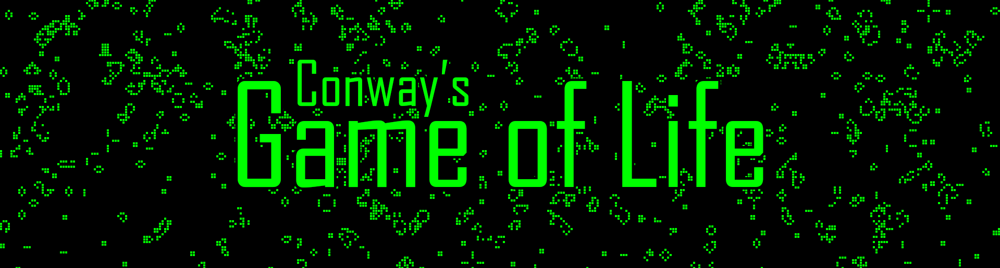

Conway's <a href="https://en.wikipedia.org/wiki/Conway%27s_Game_of_Life" style="color:green">Game of Life</a> is a cellular automaton devised by mathematician <a href="https://en.wikipedia.org/wiki/John_Horton_Conway" style="color:green">John Conway</a>. This implementation uses JavaScript to create an *interactive version* of the game. The simulation runs on a full-screen canvas with controls to start, reset, and randomize the grid.

## Rules

The universe of the Game of Life is an <i>infinite, two-dimensional orthogonal grid</i> of square cells, each of which is in one of two possible states, <b>live</b> or <b>dead</b> (or populated and unpopulated, respectively). Every cell interacts with its <i>eight neighbors</i>, which are the cells that are horizontally, vertically, or diagonally adjacent. At each step in time, the following transitions occur:

- Any live cell with fewer than two live neighbours dies, as if by underpopulation.
- Any live cell with two or three live neighbours lives on to the next generation.
- Any live cell with more than three live neighbours dies, as if by overpopulation.
- Any dead cell with exactly three live neighbours becomes a live cell, as if by reproduction.

The initial pattern constitutes the *seed* (here, the *randomized* map) of the system. The first generation is created by applying the above rules simultaneously to every cell in the seed, live or dead; births and deaths occur simultaneously, and the discrete moment at which this happens is sometimes called a tick. Each generation is a pure function of the preceding one. The rules continue to be applied repeatedly to create further generations.

    
    
A single Gosper's glider gun creating gliders

For more detailed information read [this](https://cs.stanford.edu/people/eroberts/courses/soco/projects/2001-02/cellular-automata/beginning/howtoplay.html).

### Customization

- **Cell Size:** Adjust the `cellSize` variable in `script.js` to change the size of the cells.
- **Colors:** Modify the `ctx.fillStyle` values in `script.js` to change the colors of the live and dead cells.
- **Styles:** Edit `style.css` to change the appearance of the canvas and controls.

### Bonus

Execute the python file <a href="src/conway.py" style="color:green;text-indent:50px">conway.py</a> in `./src/` folder using `python conway.py` to play the simulation full-screen over everything and make it act like a cool screen-saver of sorts.

**OR**

Run the <a href="app/dist/conway.exe" style="color:green;text-indent:50px">conway.exe</a> in `app/dist/` folder. It's an executable file for the same.

Press the `escape` button to close the script in both cases.

### License

This project is licensed under the MIT License - see the [LICENSE](LICENSE) file for details.

### Acknowledgements

- **John Conway:** For creating the original Game of Life.
- **MDN Web Docs:** For providing excellent resources on HTML, CSS, and JavaScript.

## Contact

For more information, feel free to connect with me:

- [GitHub](https://github.com/arindal1)
- [LinkedIn](https://www.linkedin.com/in/arindalchar)
- [Twitter](https://twitter.com/arindal_17)

### Keep Coding 🚀